# Architecture diagrams

Mermaid sources live in [`src/`](src/); rendered SVGs in [`svg/`](svg/) are produced by
[`tools/docs/render_diagrams.sh`](../../tools/docs/render_diagrams.sh) (pinned `@mermaid-js/mermaid-cli@11.12.0`,
headless Chromium). The script records the sha256 of each source and SVG in
[`svg/manifest.json`](svg/manifest.json); `tools/docs/render_diagrams.sh --check` fails when an SVG is missing, older
than its source, or edited by hand (check mode needs no browser).

Every diagram uses the same legend:

| Line | Meaning |
|---|---|
| solid blue arrow | application / data traffic |
| dashed purple arrow | telemetry |
| thick orange arrow | deployment / control relationship (pipeline, contracts, provisioning) |
| dotted red line ending in a cross | path that does not work (e.g. Microsoft-hosted agents to private endpoints) |
| grey dashed box | implemented but disabled by default; red box = blocked |

| Diagram | Shows | Source |
|---|---|---|
|  **Foundation** | bootstrap state + pipeline identities, hub/spoke VNets, subnets with delegations, private endpoints, private DNS, NAT / firewall egress, identities + Delinea DSV secret access (foundation-secrets), governance, deployment-agent access (Microsoft-hosted agents cannot reach private endpoints) | [01-foundation.mmd](src/01-foundation.mmd) |
|  **Platform** | compute platforms, databases, storage, messaging and how workloads reach them (private endpoints vs VNet injection vs public exceptions) | [02-platform.mmd](src/02-platform.mmd) |
|  **Application** | frontend, BFF, APIs, adapters, data ownership boundaries, Service Bus topic/subscriptions/queue, durable workflows and jobs | [03-application.mmd](src/03-application.mmd) |
|  **Telemetry** | observability 4.0.0: one log collector per architecture (Datadog Agent on AKS and VM/VMSS, serverless-init on Container Apps, Agent sidecar on ACI, diagnostic settings -> Event Hubs for PaaS, Fluent Bit on Batch) -> Observability Pipelines Worker; APM gateway and OTel gateway for managed runtimes; DSV key path via dsv-fetch; Azure integration, RUM, DBM; the `fluent_bit_direct` fallback | [04-telemetry.mmd](src/04-telemetry.mmd) |
|  **Delivery** | change detection -> selection -> validate/security/build -> per-component stages with state boundaries and contracts -> apply -> smoke/telemetry verification -> records and evidence | [05-delivery.mmd](src/05-delivery.mmd) |

The diagrams describe what the code implements. None of it has been deployed (see
[known limitations](../known-limitations.md)).

```bash
npm i -g @mermaid-js/mermaid-cli@11.12.0      # PUPPETEER_SKIP_DOWNLOAD=1 is fine when a Chromium exists
tools/docs/render_diagrams.sh                 # re-render changed sources (CHROME_BIN overrides browser discovery)
tools/docs/render_diagrams.sh --check         # staleness check
```
