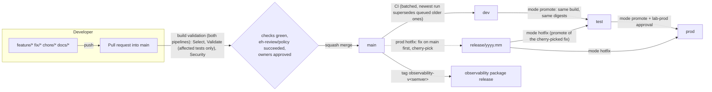

# Branching and development

Trunk-based development for many developers committing often. The model is data
([`environments/branching.yaml`](../../environments/branching.yaml)); the pipelines, the branch policies
([`tools/ado/branch_policies.py`](../../tools/ado/branch_policies.py)) and
[`.github/CODEOWNERS`](../../.github/CODEOWNERS) are generated from or enforced against it.

## Flow



| Branch | What it may do | Enforced by |
|---|---|---|
| `main` (trunk) | every mode the environment allows ([`promotion.yaml`](../../environments/promotion.yaml)); push = deploy dev | Select stage (`tools/config/branching.py check`), approvals |
| `feature/*`, `fix/*`, `chore/*`, `docs/*` | PR validation; manual runs only as `dryRun: true` plans in dev; **never apply** | `branching.py check` + `universal.yml` compiles non-trunk runs without apply jobs |
| `release/<yyyy.mm>` | only `hotfix` / `promote` / `drift` into `test` / `prod` | `branching.py check` |
| tag `observability-v*` | releases the portable observability package only | platform pipeline release stage |
| anything else | refused (rename it: branch-name policy) | Git permissions printed by `branch_policies.py plan` |

`python3 -m tools.changeset explain --branch [name]` prints what a branch may do and what a run of your working
tree would validate, build, plan and apply - before you push.

## Who approves what

Branch policies on `main` (and `release/*`) are applied idempotently by `tools/ado/branch_policies.py apply`:

* **Minimum reviewers: 1** on `main` (2 on `release/*`), votes reset on every push, the author's own vote never
  counts, the last pusher cannot approve.
* **Required status `eh-review/policy`** (blocking, applies by default, reset on push, only the reviewer bot identity
  may post it): the automated PR reviewer ([guide](automated-pr-review.md)) sets it to `succeeded` only for
  allowlisted low-risk changes, or after a non-author human approved. So **low-risk changes can be approved by the
  bot alone; every other change needs a human** - the status stays pending until one approves.
* **Protected path classes** (reviewer policy, pipelines/registry/branch-policy tooling, identity and secrets,
  network perimeter, prod configuration; generated by the reviewer into
  [`tools/review/branch-policy-fragment.json`](../../tools/review/branch-policy-fragment.json)): a required human
  owner group (`protected_owners`). The bot is never a member of these groups and has no "Bypass policies" permission.
* **Path-based owners** from the registry `owners` field (default by layer): the same map generates
  `.github/CODEOWNERS` (CI fails when it is stale).
* **GitHub Copilot code review** is requested automatically on every PR (Azure Repos preview, advisory, policy
  type discovered by name; skipped until the organization enables it) and, like every human comment, its comments
  must be resolved before completion.
* Linked work item, all comments resolved, **squash merge only**, no direct pushes (any required policy blocks them).
* **Build validation of both pipelines with `validDuration: 0`**: a PR's validation expires as soon as `main` moves,
  so every PR is validated against the newest `main` before it completes (Azure Repos' substitute for a merge queue;
  auto-complete re-queues the expired builds).

## Many commits per hour

* **Batched CI** (`trigger.batch: true`): while a run is in progress, new pushes to `main` are collected into one run.
* **Supersession on dev** (`stageLockBehavior: runLatest` in `pipelines/variables/dev.yml`): when several runs wait
  for a component's stage lock, only the newest proceeds. Safe because selection compares fingerprints with the
  **deployment records** (what really ran), not with the previous commit: the newest run selects everything the
  superseded runs would have, and nothing they already applied (proven by
  `tests/changeset/test_branching.py::test_latest_run_is_a_superset_of_superseded_runs`). test/prod stay
  `sequential` (promotions are never superseded).
* **Per-component locks**: every plan/apply stage locks `lab-<env>` per component stage; unrelated components run
  in parallel.

## Fast PR builds

* **Test impact selection** (`python3 -m tools.ci plan`): only the suites that cover the changed components and
  their consumers, plus suites whose inputs changed; docs-only changes run the link check and the gates.
* **Test result cache**: a suite whose fingerprint (sources + dependencies + tool versions) already passed is
  skipped as a "cached pass"; nightly and `release/*` runs ignore the cache.
* **Fan-out**: suites are packed into duration-balanced legs (bounded `maxParallel`), pytest suites sharded by
  file, pytest-xdist inside each leg, Terraform roots in parallel against a read-only provider mirror. Cheap gates
  cancel the run on failure.
* **Build once per fingerprint**: an artifact whose source fingerprint was already built (any branch) is reused
  by digest; images are tagged `src-<fingerprint>` plus the version and deployed by digest.
* Every PR gets a **time-budget report** (docs-only <= 2 min, single component <= 10 min, otherwise 20 min) in the
  run summary. Details: [pipelines/README.md "Fast CI"](../../pipelines/README.md#fast-ci).

## Versions

`<semver from <component>/VERSION, else 0.1.0>+<build>.<sha7>` for every branch build; a clean `<semver>` only for a
tag `<component>-v<semver>` matching `VERSION` (`tools/deploy/versioning.py`). Docker tags replace `+` with `-`.
The version is metadata (OCI label, `DD_VERSION`); deployments always reference the image digest.

## Local development

```bash
pip install pre-commit && pre-commit install       # the cheap gates on every commit (.pre-commit-config.yaml)
python3 -m tools.changeset explain --branch         # what this branch / working tree would run
python3 -m tools.ci run --changed --jobs 8          # the same selected suites as the PR build, in parallel
python3 -m tools.ci run --all                       # everything (what the nightly run does)
```

Generated files (`pipelines/generated/*`, `.github/CODEOWNERS`, compiled requirement files) are deterministic and
sorted; on a merge conflict **regenerate them, never hand-merge** (`python3 tools/pipeline/generate.py`,
`python3 tools/ado/codeowners.py`, `uv pip compile ...` as noted in each file's header). CI fails when they are stale.
